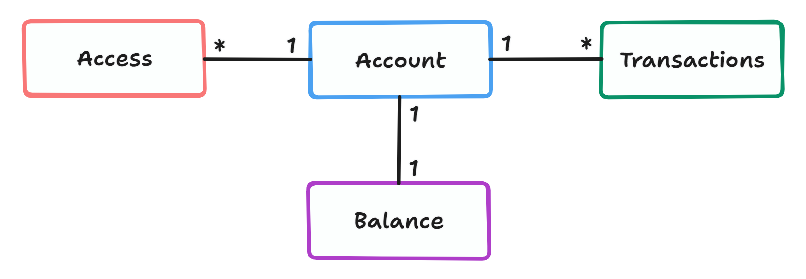
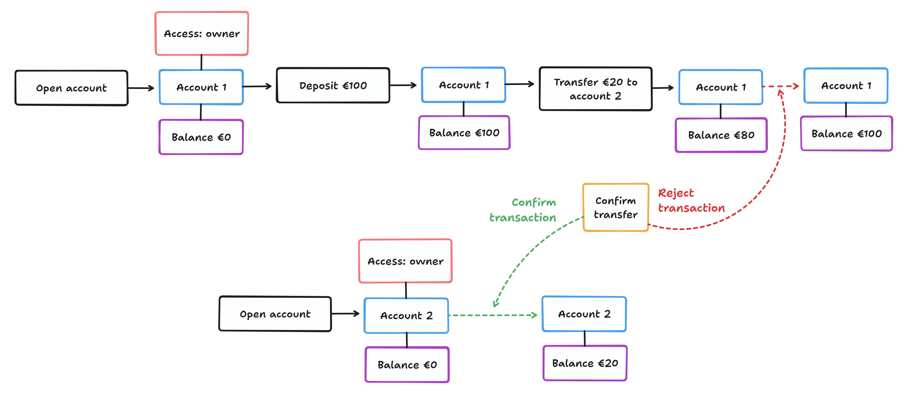

# java-spring-bank :bank:

## Description

This project is a bank REST API that offers an illustration of banking functionalities,
from creating an account and managing account access to transaction processing. It was created as a learning project to
gain proficiency in both Java and Spring Boot.

## Build the application locally

To manage the project's build I've used **Maven**.

* Set your docker engine running.
* To run the tests, run: `mvnw test`
* To create the jar file, run: `mvnw package`

## Business

The app structure revolves around 4 main models: account, access, transactions and balance.
One account has only one balance but may have many transactions (transfer, deposit or withdraw)
and also different users can have different types of access to that account.



An example of user flow would be making a transfer between 2 accounts. To create a transfer
both accounts must be open and the user creating the transfer must be the owner of the account or
have operator access.


## Tech Stack

The bank app is built using Java and Spring Boot framework.

**Additional libraries**:

- **Lombok**: to reduce boilerplate code by using annotations.
- **MyBatis**: to interact with PostgreSQL using an XML descriptor to map Java objects to database tables with minimal
  boilerplate code.
- **JUnit**: to write and run tests.
- **Mockito**: to create mock objects in unit tests to isolate the behavior of the class being tested from its
  dependencies.
- **Testcontainers**: to create disposable containers (Docker containers) to conduct the integration tests.
- **AssertJ**: to make the tests more readable by writing assertions that resemble natural language.
- **Flyway**: to manage the evolution of database schemas through series of versioned SQL migration scripts.

## Testing approach
The application has been constructed following a test-driven development (TDD) approach to ensure the code's functionality
throughout the project's lifecycle. To avoid using mocks or the H2 in-memory database to conduct integration tests, I've
used Testcontainers as it provides testing environments that resemble production.

<details>
<summary>Unit Tests</summary>

To test individual classes and functionalities. [Example's context](src/test/java/mpadillamarcos/javaspringbank/domain/account/AccountTest.java).

```java
@Test
void sets_state_to_blocked_when_blocking_an_open_account() {
    var account = dummyAccount().build();

    var blocked = account.block();

    assertThat(blocked.getState()).isEqualTo(BLOCKED);
}
```

</details>

<details>
<summary>Integration Tests</summary>

To test the interaction between the app and other components (database and API). 

- **Database**

Using Testcontainers.
```java
@Testcontainers
public class DbTestBase {

  @Container
  @ServiceConnection
  @SuppressWarnings("unused")
  static PostgreSQLContainer<?> postgres = new PostgreSQLContainer<>("postgres:15-alpine");
}
```
- **API**

Using WebMVCTest. [Example's context](src/test/java/mpadillamarcos/javaspringbank/web/transaction/TransactionControllerTest.java).

```java
@Test
void returns_bad_request_when_required_body_is_null() throws Exception {
    mockMvc.perform(post("/users/f01f898b-82fc-4860-acc0-76b13dcd78c5/accounts/f01f898b-82fc-4860-acc0-76b13dcd78c5/transfer")
                    .content("{}")
                    .contentType(APPLICATION_JSON))
            .andExpect(status().isBadRequest());
}
```
</details>

<details>
<summary>Concurrency Tests</summary>

To assure that there are no concurrency issues when sending multiple requests at once. 
[Example's context](src/test/java/mpadillamarcos/javaspringbank/domain/transaction/TransactionServiceIT.java).

```java
@Test
void updates_balances_concurrently() {
    var account1 = setupAccount(eur(2_000));
    var account2 = setupAccount(eur(2_000));

    var task1 = new TransferTask(account2, account1, eur(100));
    var task2 = new TransferTask(account1, account2, eur(100));

    runTimes(20, task1, task2);

    assertThatBalanceIs(account1, eur(2_000));
    assertThatBalanceIs(account2, eur(2_000));
}
```

</details>

<details>
<summary>End-to-End Tests</summary>

To test the app functionality from creating an account to creating the different types of transactions. It boots 
the whole app and makes some requests as an external consumer.
[Example's context](src/test/java/mpadillamarcos/javaspringbank/JavaSpringBankApplicationTests.java).

```java
@Test
void can_deposit_money() {
    var userId = randomUUID();
    var account = openAccount(userId);
    assertThat(account.getBalance()).isEqualTo(zero(EUR));

    deposit(account, eur(170));
    assertThatCurrentBalanceIs(account, eur(170));

    var transactions = listTransactions(account.getId());
    assertThat(transactions)
            .hasSize(1)
            .first()
            .returns(CONFIRMED, TransactionDto::getState)
            .returns(DEPOSIT, TransactionDto::getType);
}
```

</details>

## Challenges

- :atom: **Atomicity**: some transactions like opening an account or doing a money transfer, had to make atomic changes
in the database, that is to say, the transaction should either all succeed or all fail as a single unit. This was achieved
thanks to the `@Transactional` Spring annotation.
- :thread: **Concurrency**: any concurrency issue would have had serious consequences in the account balance when 
transferring money from one account to another. To avoid it, the rows in the database containing the balance and the 
transfer transactions involved had to be locked using the `SELECT FOR UPDATE` command until the atomic changes were done. 
- :white_check_mark: **Testing**: it was a challenge from the start as this is the first project I've worked on with TDD. I
used online resources to understand best practices and gradually built confidence by starting with simple test cases and 
progressing to more complicated ones.